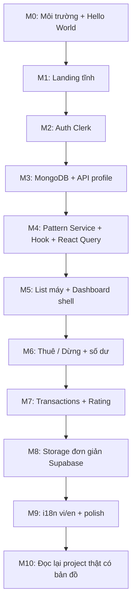

# NEXTGPU-COPY — Chiến lược học Web bằng cách làm bản sao NextGPU 

> **Dành cho:** Thực tập sinh / người mới làm web lần đầu.  
> **Mục đích:** Khi mở đoạn chat mới, đọc file này là hiểu ngay: chúng ta đang học gì, làm gì, dùng gì, và bước tiếp theo là gì.  
> **Project thật:** `nextGPU-assets` (NextGPU) — frontend thuê GPU cloud.  
> **Project học:** một bản sao **đơn giản** (mini clone), không copy 1:1 toàn bộ production.

---

## 0. Đọc trước khi làm bất kỳ điều gì

### 0.1 Mục tiêu của chúng ta

| Câu hỏi | Trả lời ngắn |
|---------|----------------|
| **Chúng ta đang làm gì?** | Học làm web bằng cách **xây một bản sao đơn giản** của NextGPU. |
| **Tại sao không đọc code thật luôn?** | Code thật quá lớn (auth, AWS, Vast.ai, S3 multipart, i18n, theme…). Clone nhỏ giúp hiểu từng lớp trước khi đọc production. |
| **Khi nào quay lại project thật?** | Sau khi clone chạy được: Landing + Auth + Dashboard + list máy + thuê/dừng giả lập + số dư. Khi đó đọc `src/services/*` và dashboard thật sẽ “nhìn ra pattern”. |
| **Clone có phải production không?** | Không. Chỉ để học. Dùng tài nguyên miễn phí. Không cần Vast.ai / GPU thật. |

### 0.2 Nguyên tắc học

1. **Làm trước, hiểu sau** — mỗi tuần một milestone chạy được trên trình duyệt.
2. **Giống pattern, khác scale** — cấu trúc folder / service / hook giống NextGPU, logic đơn giản hơn nhiều.
3. **Một luồng xuyên suốt** — luôn giữ trong đầu: `UI → Hook → Service → API → Database`.
4. **Ghi note tiến độ** — cập nhật mục [Checklist tiến độ](#12-checklist-tiến-độ) cuối file này sau mỗi milestone.
5. **Chat mới** — paste hoặc `@docs/NEXTGPU-COPY.md` và nói: *“Tiếp tục milestone X”*.

### 0.3 Từ vựng tối thiểu (học trước 30 phút)

| Thuật ngữ | Nghĩa đời thường |
|-----------|------------------|
| **Frontend** | Phần bạn thấy trên trình duyệt (nút, trang, form). |
| **Backend / API** | Phần server nhận yêu cầu, đọc DB, trả JSON. |
| **Endpoint** | “Cửa” cụ thể, ví dụ `GET /api/machines`. |
| **Request / Response** | Gửi đi / nhận về. |
| **JWT / Session** | Bằng chứng “tôi đã đăng nhập”. |
| **Database** | Nơi lưu user, máy, giao dịch. |
| **Deploy** | Đưa web lên internet (Vercel). |
| **Env variable** | Bí mật/config (URL DB, API key) không hardcode trong code. |

---

## 1. NextGPU thật là gì? (phân tích ngắn)

### 1.1 Sản phẩm

NextGPU là **nền tảng thuê GPU cloud** (chơi game / AI / render / lưu file):

- Landing marketing (vi/en)
- Đăng nhập (Clerk)
- Dashboard: Overview, My Machines, Gaming, AI/ML, Storage, Billing…
- Frontend gọi **AWS API Gateway + Lambda** (backend **không nằm trong repo này**)

Repo này chủ yếu là **frontend Next.js**. Backend production = AWS (ngoài repo).

### 1.2 Tech stack thật (bạn sẽ thấy trong `package.json`)

| Lớp | Công nghệ thật |
|-----|----------------|
| Framework | Next.js 16 (App Router), React 19, TypeScript |
| UI | Tailwind CSS 4, Radix/shadcn, Lucide, Framer Motion |
| Auth | Clerk |
| Server state | TanStack React Query |
| Client UI state | Zustand |
| HTTP | Axios → `NEXT_PUBLIC_API_URL` |
| i18n | next-intl (`vi`, `en`) |
| Theme | next-themes + gaming theme store |
| Deploy thật | Static export → S3/CloudFront (có Terraform) |

### 1.3 Cấu trúc source thật (bản đồ đọc code)

```
nextGPU-assets/
├── app/                      # Routes (App Router) — trang = folder
│   └── [locale]/            # Mỗi locale (vi/en) một nhánh URL
│       ├── page.tsx          # Landing home
│       ├── dashboard/        # Dashboard (overview, mymachines, billing…)
│       └── (landing-page)/   # Pricing, services…
├── src/
│   ├── common/               # api-endpoints.ts, query-keys.ts
│   ├── services/             # Gọi API (axios) — KHÔNG chứa UI
│   ├── hooks/                # React Query hooks — nối UI ↔ service
│   ├── features/dashboard/   # Logic + UI dashboard lớn
│   ├── components/           # UI dùng chung (home, layout, ui/)
│   ├── stores/               # Zustand (menu, theme, notification)
│   ├── lib/axios.ts          # Client HTTP dùng chung
│   ├── types/                # TypeScript types
│   └── provider/             # QueryProvider…
├── public/                   # Ảnh, video tĩnh
├── docs/                     # Tài liệu nội bộ (file này nằm đây)
└── content/help/             # Markdown help center
```

**Pattern quan trọng của project thật (bạn sẽ copy pattern này):**

```
Component (UI)
  → Hook (useUserBalance, useMachines…)
    → Service (getUserProfile, getGPUMachines…)
      → axiosInstance + API_ENDPOINTS
        → Backend API
```

File gốc để soi:

- `src/common/api-endpoints.ts`
- `src/lib/axios.ts`
- `src/services/user.service.ts`
- `src/hooks/user/useUserBalance.ts`
- `docs/architecture/PROJECT_STRUCTURE.md`
- `docs/setup/SETUP_SUMMARY.md`

### 1.4 Phần NÊN học từ project thật

- App Router + layout lồng nhau
- Tách `services/` và `hooks/`
- React Query cache (`staleTime`, `queryKey`)
- Auth gate dashboard
- TypeScript types cho response API
- i18n cơ bản (1–2 ngôn ngữ)

### 1.5 Phần NÊN BỎ / stub khi làm clone (quá nặng cho người mới)

| Bỏ / stub | Lý do |
|-----------|--------|
| Vast.ai / AI-ML tab | Lifecycle instance phức tạp |
| S3 multipart upload + phí khóa storage | Nhiều bước + billing storage |
| Dual API Gateway + parse `body` string | Đặc thù AWS |
| Static export dual-mode | Deploy production riêng |
| Locomotive Scroll parallax | Dễ lỗi SSR |
| Speedtest Cloudflare | Không cần để hiểu luồng thuê |
| driver.js tours, Tawk, Meta Pixel | Nice-to-have |
| Legal/compliance VN đầy đủ | Không cần để học kiến trúc |
| Terraform / HTTPS custom host | DevOps sau |

---

## 2. Bản sao học tập: “Mini NextGPU” trông như thế nào?

### 2.1 Tên gợi ý

Repo riêng: `nextgpu-copy` hoặc `mini-nextgpu` (đừng sửa lung tung trong repo production khi đang học cơ bản).

### 2.2 Phạm vi sản phẩm clone (MVP)

Người dùng có thể:

1. Vào **Landing** (hero + CTA “Thuê GPU”).
2. **Đăng ký / đăng nhập**.
3. Vào **Dashboard** xem **số dư**.
4. Xem **danh sách máy GPU** (data giả trong MongoDB).
5. Bấm **Thuê máy** → trừ tiền → máy vào “Máy của tôi”.
6. Bấm **Dừng thuê** → trả máy → (tuỳ chọn) popup đánh giá sao.
7. Xem **lịch sử giao dịch** đơn giản.
8. (Tuỳ chọn Phase sau) Upload 1 file nhỏ lên storage.

**Không làm:** GPU thật, remote desktop OTP, Vast.ai, payment gateway thật.

### 2.3 Mapping: Thật ↔ Clone

| NextGPU thật | Mini clone |
|--------------|------------|
| AWS API Gateway + Lambda | Next.js **Route Handlers** (`app/api/...`) hoặc Supabase Edge Functions |
| Clerk | **Clerk free** (giống thật) hoặc **Supabase Auth** (học thêm) |
| Dynamo/DB phía AWS (ẩn) | **MongoDB Atlas** (free) |
| S3 storage | **Supabase Storage** (free) |
| S3/CloudFront deploy | **Vercel** (free) |
| next-intl vi/en | Bắt đầu **1 locale (vi)**; sau thêm `en` |
| shadcn đầy đủ | 5–8 component: Button, Card, Input, Dialog, Tabs… |

---

## 3. Tài nguyên miễn phí (stack học)

### 3.1 Bắt buộc (bạn đã chọn + khuyến nghị)

| Tài nguyên | Dùng để | Free tier |
|------------|---------|-----------|
| **[Vercel](https://vercel.com)** | Host frontend + API routes Next.js | Hobby free |
| **[MongoDB Atlas](https://www.mongodb.com/atlas)** | Database: users, machines, rentals, transactions | M0 free |
| **[Supabase](https://supabase.com)** | Auth (tuỳ chọn) + **Storage** file + Postgres nếu cần | Free |
| **[Clerk](https://clerk.com)** | Auth giống project thật nhất | Free tier đủ học |
| **[GitHub](https://github.com)** | Code + CI deploy Vercel | Free |
| **Node.js 20+ + pnpm/npm** | Chạy local | Free |
| **VS Code / Cursor** | Editor | Free |

### 3.2 Nên thêm (vẫn free / generous free)

| Tài nguyên | Dùng để |
|------------|---------|
| **[Cloudinary](https://cloudinary.com)** hoặc giữ **Supabase Storage** | Upload ảnh demo landing |
| **[Resend](https://resend.com)** | Gửi email “nạp tiền thành công” giả (tuỳ chọn) |
| **[Postman](https://www.postman.com)** hoặc **Thunder Client** | Test API bằng tay trước khi nối UI |
| **[MongoDB Compass](https://www.mongodb.com/products/compass)** | Nhìn collection trên máy |
| **[Excalidraw](https://excalidraw.com)** | Vẽ flowchart luồng thuê máy |
| **[Figma](https://figma.com)** (optional) | Sketch UI 1–2 frame trước khi code |

### 3.3 Kiến trúc clone đề xuất (đơn giản, đủ học)

```
┌─────────────┐     HTTPS      ┌──────────────────────────────┐
│  Browser    │ ─────────────► │  Vercel: Next.js App         │
│  (React UI) │                │  - Pages (app/)              │
└─────────────┘                │  - API Routes (app/api/)     │
                               └───────────┬──────────────────┘
                                           │
                    ┌──────────────────────┼──────────────────────┐
                    ▼                      ▼                      ▼
             ┌────────────┐        ┌──────────────┐       ┌─────────────┐
             │ Clerk Auth │        │ MongoDB Atlas│       │ Supabase    │
             │ (login)    │        │ users,       │       │ Storage     │
             │            │        │ machines,    │       │ (files)     │
             │            │        │ rentals…     │       └─────────────┘
             └────────────┘        └──────────────┘
```

**Vì sao API Routes trong Next.js?**  
Project thật tách frontend/backend. Clone gộp backend nhỏ vào Next (`app/api`) để bạn **tự viết** endpoint, hiểu request/response — sau đó nhìn AWS Gateway của project thật sẽ dễ hơn.

**Vì sao vẫn giữ `services/` + `hooks/`?**  
Giống cấu trúc NextGPU thật → khi đọc code công ty không bị lạc.

---

## 4. Chiến lược tổng thể (roadmap 8–10 tuần)

> Tempo gợi ý cho thực tập sinh full-time học song song: **~1 milestone / tuần**.  
> Có thể nhanh/chậm hơn — quan trọng là **mỗi milestone deploy được lên Vercel**.



---

## 5. Chiến lược chi tiết theo milestone

### Milestone 0 — Thiết lập môi trường (Ngày 1–2)

**Mục tiêu:** Máy bạn chạy được Next.js; biết Git + GitHub + Vercel.

**Việc cần làm:**

1. Cài Node.js LTS (20+), Git, Cursor/VS Code.
2. Tạo repo GitHub `mini-nextgpu`.
3. `npx create-next-app@latest` — chọn: TypeScript, App Router, Tailwind, ESLint.
4. Push GitHub → Import vào **Vercel** → deploy URL công khai.
5. Tạo file `.env.local` (local) và env trên Vercel (production) — chưa cần key thật.

**Kiến thức học được:** terminal, npm scripts (`dev`/`build`), env, deploy.

**Done khi:** `https://xxx.vercel.app` hiện trang mặc định Next.js.

**Note cho chat mới:** *“Đã xong M0. Tiếp M1 landing.”*

---

### Milestone 1 — Landing page tĩnh (giống NextGPU ở mức “nhìn”)

**Mục tiêu:** 1 trang home có brand + headline + CTA.

**Cấu trúc folder gợi ý (bắt đầu giống thật):**

```
app/
  layout.tsx
  page.tsx                 # Home
  globals.css
src/
  components/
    layout/Header.tsx
    layout/Footer.tsx
    home/Hero.tsx
```

**Làm gì:**

- Header: logo “MiniNextGPU”, link Pricing / Login.
- Hero: tên brand lớn, 1 câu mô tả “Thuê GPU cloud”, nút “Bắt đầu”.
- Section ngắn: 3 lợi ích (text only — **không** cần card phức tạp / parallax).
- Footer đơn giản.

**Tham khảo project thật (đọc, đừng copy nguyên):**

- `src/components/home/*`
- `src/components/layout/Navigation.tsx`

**Bỏ:** Locomotive Scroll, multi-theme gaming, video nền nặng.

**Done khi:** Landing đẹp vừa phải, mobile không vỡ, đã deploy Vercel.

---

### Milestone 2 — Auth (Clerk) + trang Dashboard trống

**Mục tiêu:** Hiểu “đăng nhập rồi mới vào dashboard”.

**Tài nguyên:** Tài khoản Clerk → Application → Publishable/Secret keys.

**Env:**

```env
NEXT_PUBLIC_CLERK_PUBLISHABLE_KEY=pk_test_...
CLERK_SECRET_KEY=sk_test_...
```

**Làm gì:**

1. Cài `@clerk/nextjs`, bọc `ClerkProvider`.
2. Trang `/sign-in`, `/sign-up` (hoặc Clerk components).
3. Route `/dashboard` — chỉ hiện khi đã sign-in; chưa login → redirect.
4. Hiện avatar + email user từ Clerk.

**So với thật:** NextGPU dùng Clerk client-heavy vì static export. Clone dùng middleware Clerk chuẩn cũng được (đơn giản hơn để học).

**Tham khảo:** `app/components/ClerkAuth.tsx`, `docs/setup/CLERK_S3_SETUP.md`.

**Done khi:** Login → vào dashboard “Xin chào, {email}”; Logout hoạt động.

---

### Milestone 3 — MongoDB Atlas + API “profile / số dư”

**Mục tiêu:** Frontend gọi backend **do bạn viết**; backend đọc MongoDB.

**Tài nguyên:**

1. MongoDB Atlas → Create free cluster → Database user + Network Access (0.0.0.0/0 cho học, hoặc IP của bạn).
2. Connection string → `MONGODB_URI` trong `.env.local` (chỉ server, **không** `NEXT_PUBLIC_`).

**Collections tối thiểu:**

```text
users        { clerkId, email, balance, createdAt }
machines     { name, gpu, pricePerHour, status: available|rented, rentedBy? }
rentals      { userId, machineId, startedAt, endedAt?, cost }
transactions { userId, type: topup|rent|refund, amount, createdAt, note }
```

**API Routes (bắt chước tên endpoint thật):**

| Method | Path clone | Tương đương thật |
|--------|------------|------------------|
| GET | `/api/listUserProfile` | `/listUserProfile` |
| GET | `/api/listMachine` | `/listMachine` |

**Việc trong code:**

1. `src/lib/mongodb.ts` — connect singleton.
2. `app/api/listUserProfile/route.ts` — verify Clerk token → tìm/create user → trả `{ balance, email }`.
3. Seed 1 user: lần đầu login, nếu chưa có document thì tạo `balance: 100000`.

**Kiến thức:** REST, status code, JSON, secret env, auth header.

**Done khi:** Postman/Thunder gọi `GET /api/listUserProfile` với Bearer token → thấy balance.

---

### Milestone 4 — Pattern giống NextGPU: Axios + Service + Hook + React Query

**Mục tiêu:** UI **không** gọi `fetch` lung tung; đi đúng pipeline project thật.

**Tạo:**

```
src/
  common/api-endpoints.ts
  common/query-keys.ts
  lib/axios.ts                 # baseURL = '' hoặc origin
  services/user.service.ts     # getUserProfile(token)
  hooks/user/useUserBalance.ts
  provider/QueryProvider.tsx
```

**Nội dung học (bắt buộc đọc docs thật):**

- `docs/react-query/REACT_QUERY_SETUP.md`
- `docs/react-query/EXAMPLES.md`
- `src/hooks/user/useUserBalance.ts` (thật)
- `src/services/user.service.ts` (thật)

**Trên Dashboard Overview:** hiện `creditBalance` + nút Refresh.

**Done khi:** Đổi balance trong MongoDB Compass → bấm Refresh (hoặc đợi staleTime) → UI cập nhật.

---

### Milestone 5 — Dashboard shell + danh sách máy

**Mục tiêu:** Layout dashboard giống “ý tưởng” NextGPU (sidebar + content).

**Routes:**

```
/dashboard/overview
/dashboard/machines      # list máy available
/dashboard/mymachines    # máy đang thuê
/dashboard/billing       # stub
```

**API:**

- `GET /api/listMachine` → trả `{ success, machines: [...] }`
- Seed 5–8 máy giả trong MongoDB (RTX 3060, 4090… text only).

**UI:** bảng hoặc list đơn giản: tên máy, GPU, giá/giờ, status, nút “Thuê”.

**Tham khảo thật:** `src/features/dashboard/components/layout/*`, `useMachines`, `getGPUMachines`.

**Done khi:** Dashboard có sidebar; trang machines load từ API thật (Mongo).

---

### Milestone 6 — Thuê máy / Dừng thuê (trái tim nghiệp vụ)

**Mục tiêu:** Hiểu mutation + thay đổi DB + cập nhật UI cache.

**API:**

| Method | Path | Body | Logic |
|--------|------|------|--------|
| POST | `/api/deductbalance` | `{ computer_name }` | Check balance ≥ giá; trừ tiền; set machine `rented`; tạo rental + transaction; trả `sessionID` |
| POST | `/api/stopRent` | `{ computer_name }` | Tính tiền theo thời gian (hoặc flat fee học tập); unlock machine; đóng rental |

**Hooks:**

- `useDeductBalance` / `useStopRentSession` (mutation)
- Sau success: `invalidateQueries` cho balance + machines + my machines

**So với thật:**  
Thật còn desktop link, OTP, Vast, speedtest… Clone chỉ cần **trạng thái + tiền**.

**Done khi:** Thuê → số dư giảm → máy vào My Machines → Stop → máy available lại.

---

### Milestone 7 — Transactions + Rating đơn giản

**API:**

- `GET /api/listUserTransactions`
- `GET /api/getRatingStatus` — sau stopRent, `canSubmitNow: true` + `blockIndex`
- `POST /api/submitRating` — `{ blockIndex, rating, comment? }`

**UI:** Billing tab list giao dịch; Dialog đánh giá 1–5 sao.

**Done khi:** Có lịch sử nạp/thuê; sau stop hiện form rating (lưu Mongo).

---

### Milestone 8 — Storage đơn giản (Supabase Storage)

**Mục tiêu:** Hiểu “file trên cloud”, không làm multipart S3.

**Làm gì:**

1. Tạo project Supabase → Storage bucket `user-files` (private).
2. API:
   - `GET /api/listFile` — list metadata trong Mongo + signed URL
   - `POST /api/uploadfile` — nhận file nhỏ (<5MB) → upload Supabase → lưu metadata
   - `DELETE /api/deleteFile?file=...`
3. Tab Dashboard Storage: list + upload + delete.

**Bỏ:** multipart, lock price, refund pending (của project thật).

**Done khi:** Upload 1 ảnh/txt → thấy trong list → xóa được.

---

### Milestone 9 — i18n + polish

**Làm gì:**

- Cài `next-intl`, 2 file `vi.json` / `en.json` nhỏ (nav, hero, dashboard labels).
- Loading skeleton, toast lỗi (Sonner), empty state.
- README clone: cách chạy local + env cần thiết.

**Done khi:** Đổi ngôn ngữ được; UX không “gãy” khi lỗi mạng.

---

### Milestone 10 — Cầu nối về project thật (quan trọng nhất cho intern)

**Mục tiêu:** Dùng clone làm “bản đồ” để đọc NextGPU production.

**Việc làm (không code nhiều):**

1. Mở song song 2 repo.
2. Với mỗi feature clone, tìm file tương đương thật và viết note:

| Feature clone | File / folder thật |
|---------------|--------------------|
| `api-endpoints` | `src/common/api-endpoints.ts` |
| `user.service` | `src/services/user.service.ts` |
| `useUserBalance` | `src/hooks/user/useUserBalance.ts` |
| Dashboard layout | `src/features/dashboard/components/layout/` |
| Machines | `machine.service.ts`, `MyMachinesTabContainer.tsx` |
| Storage | `storage.service.ts`, `StorageTab.tsx` |
| Rating | `rating.service.ts` |

3. Mở DevTools Network trên **staging/production NextGPU** (nếu được cấp) → so request với bảng API nội bộ.
4. Đọc `docs/MOBILE_APP_IMPLEMENTATION.md` phần API inventory nếu có — để thấy cùng một backend phục vụ nhiều client.

**Done khi:** Bạn giải thích được (bằng lời) luồng “Stop rent” trên project thật: UI → hook → service → endpoint → response.

---

## 6. Chiến lược code (quy ước để giống team)

### 6.1 Quy tắc folder (bắt buộc trong clone)

```
mini-nextgpu/
├── app/
│   ├── (marketing)/page.tsx
│   ├── dashboard/...
│   └── api/                 # Backend học tập
├── src/
│   ├── common/
│   ├── services/            # Chỉ HTTP/DB orchestration phía client gọi API
│   ├── hooks/
│   ├── components/
│   ├── features/dashboard/
│   ├── lib/
│   └── types/
├── docs/
│   └── LEARNING_NOTES.md    # Note cá nhân của bạn
└── .env.example
```

### 6.2 Quy tắc viết code

1. **UI không gọi Mongo trực tiếp** — chỉ gọi `/api/...`.
2. **API Route** kiểm tra auth trước khi đọc/ghi DB.
3. **Service** trả data đã chuẩn hóa (default `balance ?? 0`).
4. **Hook** quản lý loading/error/cache.
5. **Đặt tên endpoint** gần với thật (`listMachine`, `deductbalance`) để dễ map.
6. **Type mọi response** — `type UserProfile = { balance: number; email: string }`.
7. **Không commit** `.env.local`.

### 6.3 Thứ tự implement một feature mới (mọi milestone)

```text
1. Thiết kế response JSON trên giấy / Excalidraw
2. Viết API Route + test bằng Postman
3. Viết service + type
4. Viết hook (useQuery / useMutation)
5. Viết UI
6. Deploy Vercel + kiểm tra env production
7. Ghi note 5 dòng vào LEARNING_NOTES.md
```

---

## 7. Schema MongoDB chi tiết (copy-paste khi seed)

```js
// machines
{
  _id: ObjectId,
  computer_name: "gpu-lab-01",
  gpu: "RTX 4090",
  vramGb: 24,
  pricePerHour: 15000,
  status: "available", // available | rented
  rentedByClerkId: null,
  currentSessionId: null
}

// users
{
  clerkId: "user_...",
  email: "you@example.com",
  balance: 100000,
  createdAt: ISODate()
}

// rentals
{
  sessionId: "sess_...",
  clerkId: "user_...",
  computer_name: "gpu-lab-01",
  startedAt: ISODate(),
  endedAt: null,
  rating: null,
  comment: null
}

// transactions
{
  clerkId: "user_...",
  type: "rent", // topup | rent | stop_adjust
  amount: -15000,
  note: "Rent gpu-lab-01",
  createdAt: ISODate()
}
```

---

## 8. Bảng API clone (target cuối cùng)

| Endpoint | Method | Mục đích học |
|----------|--------|--------------|
| `/api/listUserProfile` | GET | Auth + đọc user |
| `/api/listUserTransactions` | GET | List từ DB |
| `/api/listUserOwnMachines` | GET | Filter theo user |
| `/api/listMachine` | GET | List public machines |
| `/api/deductbalance` | POST | Mutation trừ tiền + thuê |
| `/api/stopRent` | POST | Mutation dừng |
| `/api/getRatingStatus` | GET | Flag UI |
| `/api/submitRating` | POST | Ghi rating |
| `/api/listFile` | GET | Storage list |
| `/api/uploadfile` | POST | Upload |
| `/api/deleteFile` | DELETE | Xóa file |

So với bảng API đầy đủ của production: clone **cố ý thiếu** Vast, OTP desktop, multipart S3, admin entry token — học core trước.

---

## 9. Kế hoạch học kiến thức nền (song song với code)

Đừng học lý thuyết cả tháng rồi mới code. Học **đúng lúc cần**:

| Khi làm milestone | Học thêm (1–2 giờ) |
|-------------------|--------------------|
| M0 | HTML/CSS cơ bản, Git commit, terminal |
| M1 | Flexbox/Grid, Tailwind utility |
| M2 | Cookie/session vs JWT (khái niệm) |
| M3 | REST, JSON, MongoDB CRUD |
| M4 | Promise/async, React Query là gì |
| M5 | Component composition, layout |
| M6 | Transaction tư duy (trừ tiền + đổi status) |
| M7 | Form + validation (zod nhẹ) |
| M8 | Blob/File, signed URL là gì |
| M9 | i18n message keys |
| M10 | Đọc architecture docs thật |

Tài liệu trong repo thật nên bookmark:

1. `docs/NEXTGPU-COPY.md` ← **file này**
2. `docs/architecture/PROJECT_STRUCTURE.md`
3. `docs/setup/SETUP_SUMMARY.md`
4. `docs/react-query/REACT_QUERY_SETUP.md`
5. `docs/hooks/HOOKS_ORGANIZATION.md`
6. (Nếu có) tài liệu API nội bộ / bảng endpoint User–Machine–Storage

---

## 10. Cách dùng file này với Chat / Agent mới

**Prompt mẫu khi mở chat mới:**

```text
Tôi là thực tập sinh đang học theo docs/NEXTGPU-COPY.md.
Mục tiêu: làm mini clone NextGPU để hiểu project thật.
Hiện tôi đang ở Milestone __ (đánh dấu trong checklist).
Repo clone: __
Hãy tiếp tục đúng chiến lược trong file đó, đừng nhảy cóc sang Vast.ai / S3 multipart.
```

**Agent / mentor nên:**

- Bám milestone hiện tại
- Giải thích “vì sao giống NextGPU”
- Chỉ ra file tương đương trong `nextGPU-assets` sau mỗi feature

---

## 11. Rủi ro thường gặp (tránh mất thời gian)

| Vấn đề | Cách tránh |
|--------|------------|
| Cố copy nguyên UI production | Chỉ lấy pattern + 1–2 màn |
| Đưa `MONGODB_URI` vào `NEXT_PUBLIC_` | Chỉ dùng server-side |
| Auth xong nhưng API không check token | Mọi route `/api/*` phải verify |
| Gọi Mongo từ Client Component | Sai — phải qua API |
| Làm theme / scroll quá sớm | Để sau M6 |
| Không deploy | Mỗi milestone 1 lần Vercel |
| Sửa lung tung repo production | Học trên repo `mini-nextgpu` riêng |

---

## 12. Checklist tiến độ

> Cập nhật `[x]` khi xong. Đây là “trạng thái học tập” để chat mới đọc.

### Môi trường & tài khoản

- [x] Node + Git + Cursor — Node `v24.18.0`, Git `2.54.0.windows.1`, Cursor
- [x] GitHub repo — dùng `NEXTGPU-COPY` (không tạo `mini-nextgpu` riêng): https://github.com/hoquan2007/NEXTGPU-COPY
- [x] Vercel project connected — https://nextgpu-copy.vercel.app/ (dashboard: [vercel.com/hnquan](https://vercel.com/hnquan))
- [ ] MongoDB Atlas cluster + Compass — để M3
- [ ] Clerk application — để M2
- [ ] Supabase project (cho M8)
- [ ] Postman / Thunder Client — để M3+

### Milestones

- [x] **M0** Hello Next.js trên Vercel — Done: https://nextgpu-copy.vercel.app/
- [ ] **M1** Landing
- [ ] **M2** Auth + dashboard trống
- [ ] **M3** Mongo + `listUserProfile`
- [ ] **M4** Service + Hook + React Query
- [ ] **M5** Machines list + dashboard shell
- [ ] **M6** Thuê / dừng + số dư
- [ ] **M7** Transactions + rating
- [ ] **M8** Storage Supabase
- [ ] **M9** i18n + polish
- [ ] **M10** Map sang source NextGPU thật + giải thích được 1 flow production

### Trạng thái M0 — chi tiết (cập nhật 2026-07-23) — **DONE**

**Đã xong**

| Mục | Chi tiết |
|-----|----------|
| Node / Git / Cursor | Máy local sẵn sàng |
| Repo GitHub | https://github.com/hoquan2007/NEXTGPU-COPY |
| Scaffold Next.js | Next.js 16 + React 19 + TypeScript + App Router + Tailwind CSS 4 + ESLint (`package.json` name: `nextgpu-copy`) |
| File env | `.env.local` (placeholder, gitignored) + `.env.example` (commit được, liệt kê key M2+) |
| `.gitignore` | Có `.env*` và exception `!.env.example` để không lộ secret |
| Build local | `npm run build` thành công (route `/` static) |
| Push code | Code scaffold trên `main` |
| Vercel deploy | https://nextgpu-copy.vercel.app/ — trang mặc định Next.js (“Create Next App”) |

**Chưa làm (để milestone sau — không blocker M0)**

| Mục | Milestone |
|-----|-----------|
| Clerk application | M2 |
| MongoDB Atlas + Compass | M3 |
| Postman / Thunder Client | M3+ |
| Supabase project | M8 |

**Giải thích ngắn scaffold (học M0)**

- `package.json` scripts: `dev` = chạy local (`localhost:3000`), `build` = build production, `start` = chạy bản đã build, `lint` = ESLint.
- `app/layout.tsx` = layout gốc (HTML shell + font + `globals.css`).
- `app/page.tsx` = trang Home `/` (UI mặc định create-next-app).
- `.env.local` chỉ trên máy bạn — Vercel sẽ có **Environment Variables** riêng khi cần (M2+). Đừng commit secret; đừng dùng prefix `NEXT_PUBLIC_` cho `MONGODB_URI`.

### Ghi chú cá nhân (điền tay)

```text
Ngày bắt đầu: 2026-07-23
Milestone hiện tại: M0 Done → sẵn sàng M1 Landing
Blocker gần nhất: (không)
Link Vercel: https://nextgpu-copy.vercel.app/
Link GitHub clone: https://github.com/hoquan2007/NEXTGPU-COPY
Tài khoản Vercel: https://vercel.com/hnquan
Tài khoản GitHub: https://github.com/hoquan2007
```

---

## 13. Định nghĩa “Hoàn thành” chương trình học clone

Bạn **đạt mục tiêu intern** của file này khi:

1. Mini clone deploy public, login được, thuê/dừng máy giả lập được.
2. Bạn tự vẽ lại (không nhìn) sơ đồ: `UI → Hook → Service → API → Mongo`.
3. Bạn mở được `MyMachinesTabContainer.tsx` (project thật) và chỉ ra đâu là fetch, đâu là mutation, đâu là UI.
4. Bạn biết chỗ nào production phức tạp hơn clone (Vast, S3, OTP) và **vì sao**.

Sau đó: chuyển sang task thật trên `nextGPU-assets` với mentor — bug nhỏ, copy UI, thêm translation key, v.v.

---

## 14. Tóm tắt một trang (in ra dán bàn)

**Mục đích:** Học web bằng mini clone NextGPU → hiểu project công ty.  
**Stack học:** Next.js + TypeScript + Tailwind + Clerk + MongoDB Atlas + Vercel + Supabase Storage.  
**Pattern vàng:** `hooks → services → api-endpoints → axios`.  
**Thứ tự:** M0 môi trường → Landing → Auth → DB/API → React Query → Machines → Rent/Stop → Billing/Rating → Storage → i18n → Đọc code thật.  
**Không làm sớm:** Vast.ai, multipart S3, Locomotive, dual gateway, static export.  
**Chat mới:** `@docs/NEXTGPU-COPY.md` + nói milestone hiện tại.

---

*Tài liệu này thuộc chương trình onboarding tự học cho thực tập sinh. Không thay thế kiến trúc production NextGPU. Cập nhật checklist khi tiến bộ.*
